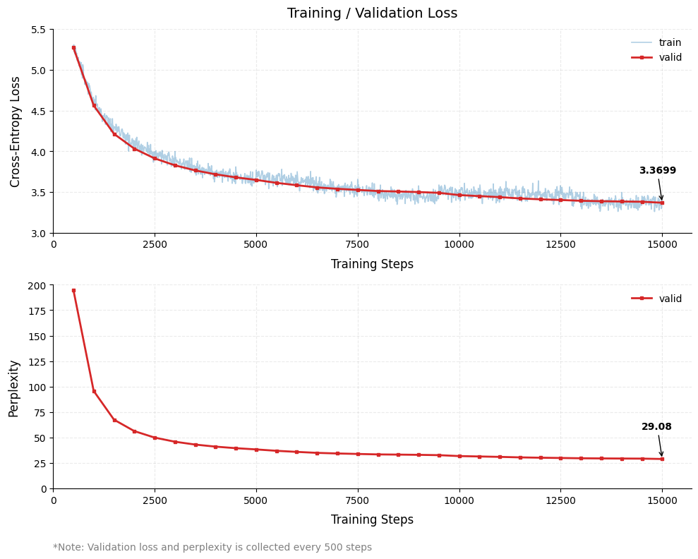
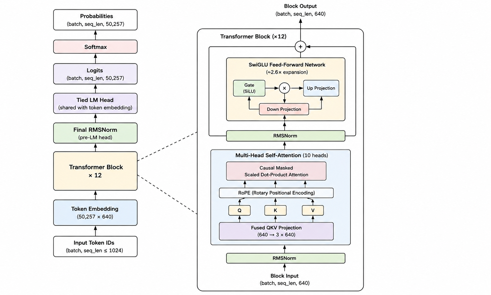

# Mini-LLM

A 90M-parameter GPT-style decoder-only transformer built from scratch in PyTorch and trained on 2 billion tokens of [FineWeb-Edu](https://huggingface.co/datasets/HuggingFaceFW/fineweb-edu).

**Model weights:** *TODO: upload model weights to Hugging Face and add link here*

## 1. Results

### Zero-Shot Benchmarks

MiniGPT (90M, step 15,000) vs GPT-2 small (124M), evaluated with lm-evaluation-harness. The benchmark covers a range of language understanding and reasoning tasks, including next-token prediction, commonsense reasoning, reading comprehension, and word-level knowledge.


**Accuracy** (higher is better)

| Task          |     MiniGPT (90M) | GPT-2 small (124M) |          Δ |
| :------------ | ----------------: | -----------------: | ---------: |
| Lambada       |     0.192 ± 0.005 |  **0.326** ± 0.007 |     −0.134 |
| HellaSwag     |     0.282 ± 0.004 |  **0.311** ± 0.005 |     −0.029 |
| ARC-Easy      | **0.416** ± 0.010 |      0.395 ± 0.010 | **+0.021** |
| ARC-Challenge | **0.239** ± 0.012 |      0.227 ± 0.012 | **+0.012** |
| PIQA          |     0.591 ± 0.011 |  **0.625** ± 0.011 |     −0.034 |
| WinoGrande    |     0.511 ± 0.014 |  **0.516** ± 0.014 |     −0.005 |

**Perplexity** (Whole-corpus perplexity, lower is better.)

| Task            | MiniGPT (90M) | GPT-2 small (124M) |      Δ |
| :-------------- | ------------: | -----------------: | -----: |
| Lambada         |         358.3 |           **40.1** | +318.2 |
| Wikitext (word) |          64.1 |           **37.4** |  +26.7 |

### Training Dynamics

Training and validation loss over steps 0 to 15,000.



Validation loss continues to track training loss through the end of the run.

### Text Generation Samples

Samples generated from MiniGPT at step 15,000.

**Sample 1** (temperature=0, greedy sampling)

```text
What is the capital of France and why does it matter historically?
\nThe capital of France is the capital of France. It is the capital of France. 
It is the capital of France. It is the capital of France. It is the capital of France.
```

**Sample 2** (temperature=1.0, top_k=None, top_p=0.95)

```text
Let's tell a stories about a researcher working on these issues. He was really qualified to receive the 
Chief Account Number and Associate in Government and Liberal Affairs. The problem with the 6 units 
(TCs, divided into CAPs and CAPs) is how you can preserve your time and your finance
```

**Sample 3** (extremely long context)
The text below is generate with 10,240 token length. Below shows the ability to keep coherent text until the last token.

```text
She opened the letter and immediately knew that the news was too bad for the Editor ......
this case focus is part of the Lawyers’ Center for Global Legal Studies, which reduces the" 
```

### Findings

* MiniGPT matches or exceeds GPT-2 small on ARC-Easy and ARC-Challenge despite having fewer parameters.
* LAMBADA is the largest weakness in both accuracy and perplexity.
* Wikitext word perplexity is substantially closer to GPT-2 than LAMBADA perplexity.
* The model improved between step 13,000 and step 15,000 across the reported generative metrics (Lambada acc: 0.191 ± 0.005 ppl: 411.451, wikitext ppl: 66.267).
* Validation loss continues to track training loss at step 15,000, suggesting the run had not clearly plateaued.
* High-quality text generation remains challenging, with sampling strategies having a noticeable impact on output quality and providing opportunities for further experimentation.

### Interpreting the Perplexity Gap

MiniGPT's perplexity is substantially higher than GPT-2's on the reported tasks. Several factors may contribute:

1. **Training data scale:** MiniGPT was trained on 2B tokens, while GPT-2 was trained on a substantially larger corpus.
2. **Domain shift:** Wikitext and LAMBADA differ from the FineWeb-Edu training distribution. Wikitext word perplexity provides a cleaner comparison than LAMBADA for this model.
3. **Training progress:** The model was still improving at step 15,000. The earlier step 13,000 checkpoint had worse generative metrics across the reported evaluations.

These results are from a single 90M-parameter model trained for 2B tokens, so they should be interpreted in the context of the different model sizes, datasets, and training budgets.

## 2. Model Architecture



|                         |                                                                 |
| ----------------------- | --------------------------------------------------------------- |
| Vocab / context | 50,257 tokens (BPE, r50k) / seq_len 1024 |
| Hidden / heads / layers | embed_dim 640 / 10 heads / 12 layers |
| Attention | fused QKV → RoPE → causal masked MHA |
| Feed-forward | SwiGLU (SiLU-gated), ~2.6× expansion, no bias |
| Normalization | pre-norm RMSNorm before attention + FFN |
| Output | final RMSNorm and tied LM head (shared embedding weights) |

## 3. Implementation

* KV cache with sliding-window generation for generation beyond the training context.
* Text sampling with temperature, top-k, top-p, and repetition annealing.
* JSON configs as the single source of truth in `configs/*.json`.
* Generated text quality analyzer for repetition rate.
* `lm-eval` benchmark harness for MiniGPT and GPT-2.
* Pytest suite with fast and slow markers.
* Distributed training with DDP.
* `torch.compile` support for GPU training.

## 4. Project Structure

```text
src/
├── main.py           # training entrypoint (loads configs/*.json)
├── train.py          # Trainer: AMP, grad-accum, DDP, resume, eval, ckpt
├── model.py          # MiniGPT, MultiHeadAttention, KVCache, SwiGLU
├── pos_encoding.py   # RoPE + sinusoidal variants
├── data.py           # FineWeb-Edu streaming -> tokenized .bin + DataLoader
├── generate.py       # Generator + sampler (KV cache, sliding window, CLI)
├── analyzer.py       # summarize samples/*.jsonl into a comparison table
├── config.py         # dataclasses + from_json/to_json
├── utils.py          # shared helpers
└── benchmark/        # bench.py + MiniGPT_LM wrapper (lm-eval)

configs/              # model.json, data.json, train.json, gen.json, bench.json
tests/                # pytest (fast + slow)
checkpoints/          # trained checkpoints (gitignored)
samples/              # generation experiment logs (JSONL)
```

## 5. Setup

### Requirements

The project is written in Python and PyTorch. GPU training is recommended.

All configuration files live in `configs/*.json`. CLI flags can override individual configuration values when needed.

```bash
pip install -r requirements.txt

# CPU
pip install torch --index-url https://download.pytorch.org/whl/cpu

# CUDA
pip install torch --index-url https://download.pytorch.org/whl/cu128
```

The CUDA PyTorch installation should match the CUDA environment available on the machine.

### Configuration

The main configuration files are:

```text
configs/
├── model.json
├── data.json
├── train.json
├── gen.json
└── bench.json
```

The JSON files are the primary source of model, data, training, generation, and benchmark configuration. CLI overrides can be used for individual experiments without modifying the files.

## 6. Training Setup

The reported training run used:

|                              |                                    |
| ---------------------------- | ---------------------------------- |
| Model                        | 90M parameters                     |
| Dataset                      | FineWeb-Edu                        |
| Training tokens              | 2B                                 |
| Context length               | 1024                               |
| Global batch size            | 16                                 |
| Gradient accumulation        | 8 steps                            |
| Effective batch size         | 128 sequences                      |
| Tokens per optimization step | 131,072                            |
| Hardware                     | 2× NVIDIA T4                       |
| Distributed training         | PyTorch DDP                        |
| Compilation                  | `torch.compile`                    |
| Total GPU time               | ~20 hours across 4 Kaggle sessions |
| Training throughput          | ~30k train tokens/s                |

The training was split across four Kaggle sessions because of the 12-hour session limit.

## 7. Reproducing Training

Use `--eval_every` to control how frequently evaluation and checkpointing are performed. And `--resume` to resume training from a checkpoint

**Note:** When using `torch.compile`, the initial compilation can temporarily increase VRAM usage. If this causes an OOM, start with a smaller batch size and a lower `train.evals_every` value for the first run. Then increase the batch size once the first few steps of the model is saved


```bash
# Run a short smoke test
python src/main.py --steps 500

# Resume training from a checkpoint:
python src/main.py --resume "checkpoints/mini/step_15000.pt"

# Override configuration values from the command line:
python src/main.py --override data.num_workers=8 train.max_iters=20000

# Enable `torch.compile`:
python src/main.py --compile

# Run multi-GPU training with DDP and `torch.compile`:
torchrun --nproc_per_node=2 src/main.py \
    --resume "checkpoints/mini/step_15000.pt" \
    --compile
```

## 8. Text Generation

Generate text from a prompt with KV caching to reduce the memory load.

**Note:** Generating text beyond the model context length need to specify `--keep` (the last n amount of tokens that model keeps to rebuild once the generated text length >= context)

```bash
python src/generate.py \
    --prompt "Once upon a time" \
    --max-tokens 300 \
    --temperature 0.8 \
    --top-k 50 \
    --top-p 0.95 \
    --max-tokens 2048 \
    --keep 512
```

Generation supports KV caching, sliding-window context, temperature sampling, top-k sampling, top-p sampling, and repetition annealing.

## 9. Text Quality Analysis

Summarize all generated samples and calculate repetition statistics (n-gram and unique words):

```bash
# Analyze all .JSONL files in samples/
python src/analyzer.py

# Analyze specific .JSONL files in
python src/analyze.py "samples/generations_step_6500.jsonl"
```

## 10. Benchmarking

Run the benchmark harness from the repository root. `--bootstrap_iters` is for calculating the std error which the default value is 100000 but it's not necessary to be that high to get usable result.

```bash
python src/benchmark/bench.py \
    --batch_size 16 \
    --bootstrap_iters 1000 \
    --ckpt "checkpoints/mini/step_15000.pt" \
    --tasks lambada_openai wikitext
```

## 11. Testing

```bash
# Run the full test suite:
python -m pytest tests/

# Run only the fast tests:
python -m pytest tests/ -m "not slow"
```

## 12. License

MIT
